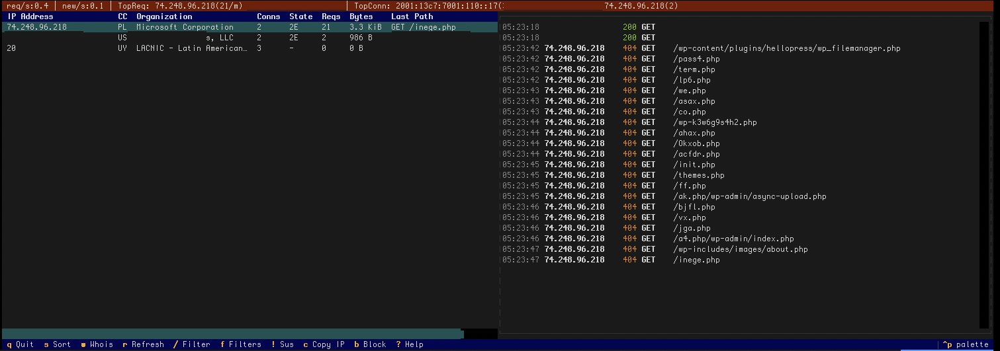

# Nethergaze

Live correlate TCP connection state with HTTP requests and enrich suspicious IPs all in a terminal dashboard.


*Not a replacement for ELK or Grafana. It's a **live triage console** this tool competes with your own shell muscle memory, not big observability stacks.*



> **What you're seeing:** The left panel correlates each IP's TCP connections with its HTTP requests, country, org, connection count, and bytes all in a single view. The right panel streams color coded access log entries in real time. The top bar surfaces the highest traffic IPs at a glance. An IP with 10 connections but zero requests? That's whack suspicious. An IP hammering `/wp-login.php` at 200 req/min? You'll see it instantly and can quickly block without needing to leave the tool or your chair.

- **Top offenders bar** — Real time req/s, new connections/s, and top 3 IPs by request rate and connection count
- **IP drill-down**  Press Enter on any IP for full detail: connections, recent requests, whois info
- **Suspicious mode**  One key toggle to surface SYN floods, scanners, and burst traffic
- **Structured filters**  Filter by TCP state, status codes, request rate, CIDR ranges, or free text  applied to both panels
- **Block assist**  Auto detect your firewall (ufw/nft/iptables) and generate or execute block commands from the TUI
- **Auto-enrichment**  GeoIP and whois/RDAP lookups run in background threads for every new IP

## Why It Matters

During my initial deployment, Nethergaze revealed a **SYN flood attack** — 254 half-open connections from a Brazilian botnet (~30 IPs across two /24 blocks) hammering port 443. The connections showed up in the table with country/org data but zero completed requests, which made the pattern immediately obvious. Without this kind of correlation between TCP state and HTTP logs, the attack would have gone unnoticed until performance degraded or my vps host reached out and yelled at me.

Pressing `!` to toggle suspicious mode instantly filtered the view down to only the attacking IPs. Pressing `b` generated a `sudo ufw insert 1 deny from ...` command ready to copy and run.


> **What you're seeing:** Suspicious mode (`!`) filtered the table to only anomalous IPs. Every row is BR / 67 TELECOM with 10+ connections, zero requests, zero bytes — a textbook SYN flood. The top bar confirms the pattern: `TopConn` shows the worst offenders. From here, `b` generates a firewall block command and `c` copies the IP. This was a happy accident during testing.

`ss` shows connections but not what they're requesting. Access logs show requests but not TCP state. Nethergaze joins them by IP in real time so anomalies, botnets, scanners, misbehaving clients all that stand out at a quick glance.

## How It Works

**The problem:** Your existing tools show slices of the picture. `ss` gives you TCP state but not what IPs are requesting. Access logs show HTTP requests but not the underlying connections. When a botnet opens 200 half-open connections and never sends a request, your access logs are silent.

**The solution:** Nethergaze reads all the data sources in parallel and joins them by IP address in a thread-safe correlation engine:

```
/proc/net/tcp (1s poll) -->                  --> Connections Table
HTTP access logs (0.5s) --> Correlation      --> HTTP Activity Log
vnstat (30s)            -->   Engine         --> Top Offenders Bar
whois/RDAP (async)      --> (IPProfile dict) --> Header / Stats Bar
GeoIP (sync, cached)    -->                  --> Filter Engine
```

**What makes it fast:** Nethergaze runs on the same box it monitors without adding load.

- **Connections**  Reads `/proc/net/tcp` directly (no subprocess). Faster than shelling out to `ss` or `netstat`.
- **Log tailing**  Inode-based rotation detection, seek to end on first open (only tails new lines, never replays the full file). Glob patterns tail all vhost logs simultaneously.
- **GeoIP**  Sync lookups against local MMDB files, memory cached. No network calls. ~0.1ms per lookup.
- **Whois/RDAP** Async in a capped thread pool (3 workers). RDAP first, legacy whois fallback, 10s timeouts, disk-cached 24h. Failed lookups retry on next encounter.
- **Per-IP rate tracking** —Rolling 60 second window powers filters, suspicious mode, and the top offenders bar.
- **Enrichment off**  `--no-whois --no-geoip` disables all outbound calls for high traffic environments.

No telemetry, no analytics, no phoning home. The only outbound calls are whois/RDAP lookups for IP enrichment, and those are opt-out with `--no-whois`.

## Install

```bash
pipx install git+https://github.com/OuttaMyDepth/NetherGaze.git
```

To hack on it:

```bash
git clone https://github.com/OuttaMyDepth/NetherGaze.git
cd NetherGaze
pip install -e .
```

### GeoIP Databases (Recommended)

For country, city, and ASN resolution, install free [DB-IP Lite](https://db-ip.com/db/lite.php) databases (no account required):

```bash
sudo mkdir -p /usr/share/GeoIP && cd /tmp
wget -q "https://download.db-ip.com/free/dbip-city-lite-$(date +%Y-%m).mmdb.gz"
wget -q "https://download.db-ip.com/free/dbip-asn-lite-$(date +%Y-%m).mmdb.gz"
gunzip dbip-city-lite-*.mmdb.gz dbip-asn-lite-*.mmdb.gz
sudo mv dbip-city-lite-*.mmdb /usr/share/GeoIP/GeoLite2-City.mmdb
sudo mv dbip-asn-lite-*.mmdb /usr/share/GeoIP/GeoLite2-ASN.mmdb
```

[MaxMind GeoLite2](https://dev.maxmind.com/geoip/geolite2-free-geolocation-data) databases also work (same MMDB format). DB-IP Lite updates on the 1st of each month. Without GeoIP databases, Nethergaze falls back to whois for org names but country codes will be unavailable.

## Quick Start

```bash
# auto-discovers per-vhost nginx logs
nethergaze

# Point at specific logs
nethergaze --log-path "/var/log/nginx/mysite.access.log"

# Glob for all vhost logs
nethergaze --log-path "/var/log/nginx/*.access.log"

# Caddy JSON logs
nethergaze --log-path "/var/log/caddy/access.log" --log-format json

# Headless / high-traffic skip enrichment
nethergaze --no-whois --no-geoip
```

Minimal config at `~/.config/nethergaze/config.toml`:

```toml
log_path = "/var/log/nginx/*.access.log"
interface = "eth0"
```

Everything else has reasonable defaults.

### Log Format Support

Auto-detected per line. Override with `--log-format` if needed:

| Format | Description | Servers |
|--------|-------------|---------|
| `auto` | Tries each format in order (default) | Any |
| `combined` | CLF + referrer + user-agent | nginx, Apache |
| `common` | Common Log Format | Apache, minimal configs |
| `json` | JSON lines, nested or flat keys | Caddy |

### Key Bindings

| Key | Action |
|-----|--------|
| `q` | Quit |
| `Tab` / `Shift+Tab` | Switch panel focus |
| `Enter` | Drill down into selected IP |
| `s` | Cycle sort column (connections / requests / bytes / IP) |
| `w` | Trigger whois lookup for selected IP |
| `r` | Force refresh all data |
| `/` | Quick text filter (Enter to apply, Escape to dismiss) |
| `f` | Open structured filter modal (TCP state, status codes, request rate) |
| `!` | Toggle suspicious mode — surface SYN floods, scanners, burst traffic |
| `c` | Copy selected IP to clipboard |
| `b` | Show block command for selected IP (auto-detects ufw/nft/iptables) |
| `?` | Show key bindings |

## Configuration

Full config reference — copy `config.example.toml` to `~/.config/nethergaze/config.toml`:

```toml
# Glob pattern to watch multiple vhost logs at once
log_path = "/var/log/nginx/*.access.log"
log_format = "auto"     # auto | combined | common | json

interface = "ens3"       # Network interface for vnstat bandwidth
show_private_ips = false # Filter Docker/internal IPs from display

[refresh]
connections_interval = 1.0   # /proc/net/tcp poll (seconds)
log_interval = 0.5           # Log tail poll
bandwidth_interval = 30.0    # vnstat poll

[geoip]
enabled = true
city_db = "/usr/share/GeoIP/GeoLite2-City.mmdb"
asn_db = "/usr/share/GeoIP/GeoLite2-ASN.mmdb"

[whois]
enabled = true
cache_ttl = 86400   # 24-hour disk cache
max_workers = 3     # Max concurrent lookups

[filters]
# CIDR allow/deny lists (IPs outside allow or inside deny are hidden)
# cidr_allow = []
# cidr_deny = ["10.0.0.0/8"]
suspicious_burst_rpm = 60      # Req/min threshold for burst detection
suspicious_min_conns = 5       # Min connections for "high conns + low reqs" pattern
# scanner_user_agents = ["custom-bot"]   # Extra scanner UA patterns

[actions]
enable_block_execution = false  # Allow executing block commands (requires sudo)
# Custom action hooks:
# [[actions.hooks]]
# key = "1"
# label = "Reverse DNS"
# command = "dig -x {ip}"
```

Resolution order: CLI flags > environment variables (`NETHERGAZE_*`) > config file > defaults.

### Privacy / Outbound Calls

| Data sent | Destination | Protocol | Opt-out |
|-----------|-------------|----------|---------|
| Remote IP address | RDAP servers (ARIN, RIPE, LACNIC, etc.) | HTTPS | `--no-whois` |
| Remote IP address | Legacy whois servers (port 43) | TCP | `--no-whois` |
| None (local file reads) | GeoIP MMDB on disk | N/A | `--no-geoip` |

Whois cache is stored locally at `~/.cache/nethergaze/whois_cache.json`. GeoIP results are memory-only (not persisted).

## Requirements

- Python 3.11+
- Linux (reads `/proc/net/tcp`)
- HTTP server with combined, common, or JSON log format (nginx, Apache, Caddy)
- Optional: `vnstat` for bandwidth stats
- Optional: MMDB GeoIP databases (DB-IP Lite or MaxMind GeoLite2) for country/city/ASN

## License

MIT
