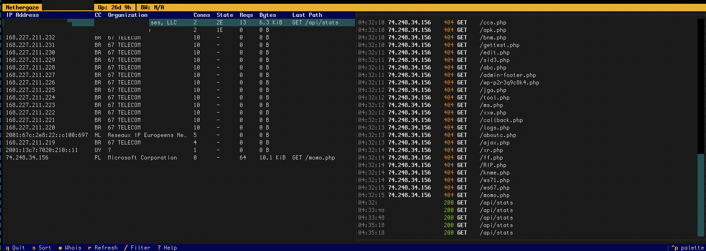

# Nethergaze

Live correlate TCP connection state with HTTP requests and enrich suspicious IPs — in a terminal dashboard.


*Not a replacement for ELK or Grafana. It's a **live triage console** — competes with your own shell muscle memory, not big observability stacks.*



- **Left panel** — Sortable table of connected IPs with country, org (GeoIP + whois), connection count, requests, bytes
- **Right panel** — Color-coded streaming HTTP log (green=2xx, yellow=4xx, red=5xx) with live filtering
- **IP drill-down** — Press Enter on any IP for full detail: connections, recent requests, whois info
- **Auto-enrichment** — GeoIP and whois/RDAP lookups run in background threads for every new IP

## Why It Matters

During initial deployment, Nethergaze revealed a **SYN flood attack** — 254 half-open connections from a Brazilian botnet (~30 IPs across two /24 blocks) hammering port 443. The connections showed up in the table with country/org data but zero completed requests, which made the pattern immediately obvious. Without this kind of correlation between TCP state and HTTP logs, the attack would have gone unnoticed until performance degraded.

`ss` shows connections but not what they're requesting. Access logs show requests but not TCP state. Nethergaze joins them by IP in real time so anomalies — botnets, scanners, misbehaving clients — stand out at a glance.

## Install

```bash
# From PyPI (when published)
pipx install nethergaze

# From source
git clone https://github.com/OuttaMyDepth/NetherGaze.git
cd nethergaze
pipx install .        # isolated install, or:
pip install -e .      # editable dev install in a venv
```

### GeoIP Databases (Recommended)

For country, city, and ASN resolution, install free [DB-IP Lite](https://db-ip.com/db/lite.php) databases (no account required):

```bash
sudo mkdir -p /usr/share/GeoIP && cd /tmp
wget -q "https://download.db-ip.com/free/dbip-city-lite-$(date +%Y-%m).mmdb.gz"
wget -q "https://download.db-ip.com/free/dbip-asn-lite-$(date +%Y-%m).mmdb.gz"
gunzip dbip-city-lite-*.mmdb.gz dbip-asn-lite-*.mmdb.gz
sudo mv dbip-city-lite-*.mmdb /usr/share/GeoIP/GeoLite2-City.mmdb
sudo mv dbip-asn-lite-*.mmdb /usr/share/GeoIP/GeoLite2-ASN.mmdb
```

[MaxMind GeoLite2](https://dev.maxmind.com/geoip/geolite2-free-geolocation-data) databases also work (same MMDB format). DB-IP Lite updates on the 1st of each month. Without GeoIP databases, Nethergaze falls back to whois for org names but country codes will be unavailable.

## Quick Start

```bash
# Just run it — auto-discovers per-vhost nginx logs
nethergaze

# Point at specific logs
nethergaze --log-path "/var/log/nginx/mysite.access.log"

# Glob for all vhost logs
nethergaze --log-path "/var/log/nginx/*.access.log"

# Caddy JSON logs
nethergaze --log-path "/var/log/caddy/access.log" --log-format json

# Headless / high-traffic — skip enrichment
nethergaze --no-whois --no-geoip
```

Minimal config at `~/.config/nethergaze/config.toml`:

```toml
log_path = "/var/log/nginx/*.access.log"
interface = "eth0"
```

That's it. Everything else has sensible defaults.

### Log Format Support

Auto-detected per line. Override with `--log-format` if needed:

| Format | Description | Servers |
|--------|-------------|---------|
| `auto` | Tries each format in order (default) | Any |
| `combined` | CLF + referrer + user-agent | nginx, Apache |
| `common` | Common Log Format | Apache, minimal configs |
| `json` | JSON lines, nested or flat keys | Caddy |

### Key Bindings

| Key | Action |
|-----|--------|
| `q` | Quit |
| `Tab` / `Shift+Tab` | Switch panel focus |
| `Enter` | Drill down into selected IP |
| `s` | Cycle sort column (connections / requests / bytes / IP) |
| `w` | Trigger whois lookup for selected IP |
| `r` | Force refresh all data |
| `/` | Filter log entries (Enter to apply, Escape to dismiss) |
| `?` | Show key bindings |

## Configuration

Full config reference — copy `config.example.toml` to `~/.config/nethergaze/config.toml`:

```toml
# Glob pattern to watch multiple vhost logs at once
log_path = "/var/log/nginx/*.access.log"
log_format = "auto"     # auto | combined | common | json

interface = "ens3"       # Network interface for vnstat bandwidth
show_private_ips = false # Filter Docker/internal IPs from display

[refresh]
connections_interval = 1.0   # /proc/net/tcp poll (seconds)
log_interval = 0.5           # Log tail poll
bandwidth_interval = 30.0    # vnstat poll

[geoip]
enabled = true
city_db = "/usr/share/GeoIP/GeoLite2-City.mmdb"
asn_db = "/usr/share/GeoIP/GeoLite2-ASN.mmdb"

[whois]
enabled = true
cache_ttl = 86400   # 24-hour disk cache
max_workers = 3     # Max concurrent lookups
```

Resolution order: CLI flags > environment variables (`NETHERGAZE_*`) > config file > defaults.

## Performance

Nethergaze is designed to run on the same box it monitors without adding load:

- **GeoIP** — Sync lookups against local MMDB files, results memory-cached for the session. No network calls. ~0.1ms per lookup.
- **Whois/RDAP** — Async in a capped thread pool (default: 3 workers). RDAP tried first; on failure (e.g., LACNIC 403), falls back to legacy whois with 10-second timeout. Results disk-cached for 24 hours at `~/.cache/nethergaze/whois_cache.json`. Failed lookups are not cached and retry on next encounter.
- **Connections** — Reads `/proc/net/tcp` directly (no subprocess). Faster than shelling out to `ss` or `netstat`.
- **Log tailing** — Inode-based rotation detection, seek-to-end on first open (only tails new lines, never replays the full file).
- **Enrichment off** — `--no-whois --no-geoip` disables all outbound calls for high-traffic environments where you only need the correlation.

### Privacy / Outbound Calls

Nethergaze makes outbound network requests only for IP enrichment:

| Data sent | Destination | Protocol | Opt-out |
|-----------|-------------|----------|---------|
| Remote IP address | RDAP servers (ARIN, RIPE, LACNIC, etc.) | HTTPS | `--no-whois` |
| Remote IP address | Legacy whois servers (port 43) | TCP | `--no-whois` |
| None (local file reads) | GeoIP MMDB on disk | N/A | `--no-geoip` |

No telemetry, no analytics, no phoning home. Whois cache is stored locally at `~/.cache/nethergaze/whois_cache.json`. GeoIP results are memory-only (not persisted).

## Architecture

```
/proc/net/tcp (1s poll) -->                  --> Connections Table
HTTP access logs (0.5s) --> Correlation      --> HTTP Activity Log
vnstat (30s)            -->   Engine         --> Header Bar
whois/RDAP (async)      --> (IPProfile dict) --> Stats Bar
GeoIP (sync, cached)    -->
```

Key implementation details:

- **Multi-file log watching** — `log_path` accepts glob patterns (e.g., `/var/log/nginx/*.access.log`) to tail all vhost logs simultaneously, with periodic rescan for new files
- **Private IP filtering** — Docker bridge / internal traffic (172.x, 10.x, etc.) is filtered from display by default
- **Whois resilience** — RDAP first, legacy whois fallback, 10s timeouts, proper socket cleanup to prevent CLOSE-WAIT leaks
- **Stale profile cleanup** — IPs with no connections and no request history are auto-pruned from display

## Requirements

- Python 3.11+
- Linux (reads `/proc/net/tcp`)
- HTTP server with combined, common, or JSON log format (nginx, Apache, Caddy)
- Optional: `vnstat` for bandwidth stats
- Optional: MMDB GeoIP databases (DB-IP Lite or MaxMind GeoLite2) for country/city/ASN

## License

MIT
